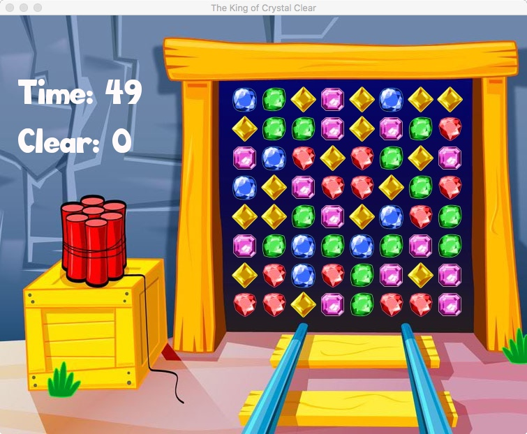

# CrystalClear
A minimal implementation of match-3 game using only c++ and libSDL2.  
Here is a similar game: http://www.royalgames.com/games/puzzle-games/miner-speed/

## Look and fell

## Terminology
- Crystal: the clolorful stones on the board.

- CrystalMatrix: the play area divided into 2D grids holding crystals.

## Usage
- The game consists of a 8x8 grid with different colored objects
- The objects can swap place as long as they are positioned next to each other and on the same row or column (up, down, left, right)
- If a switch result in three or more object of the same color in a row or column, these objects are removed from the game
- If a switch does not result in a match, the objects are automatically switched back
- When objects are removed from the game, the game board collapses so that object positioned above the removed ones falls down to take their place and new objects falls in from the top to fill the board.
- 1 minute long
- 5 colours
- User can drag or click objects to swap them (both dragging and clicking should work)

## Design
4 classes + 1 global seeting + 1 main function. It is introduced in a bottom-up manner.

The meanings of variables/functions/logics/classes are explained in the comments unless it's already quite self-explaining by its name.

- Class: Crystal.hpp/cpp - The entity of a crystal.
- Class: CrystalMatrix.hpp/cpp - The entity of the play area; i.e. a matrix of crystals.
- Class: RenderDelegate.hpp/cpp - The encapsulation of rendering functions relevant to this game.
- Class: GameMaster.hpp/cpp - The high-level game control logics, using class CrystalMatrix & RenderDelegate.

The relationship among classes is illustrated in a "fancy" graph below :D

GameMaster &larr; RenderDelegate  
&uarr;           
CrystalMatrix &larr; Crystal

- GlobalSettings.hpp - The parameter settings for the game.
- main.cpp - Instantiate GameMaster and let it enter running loop.
